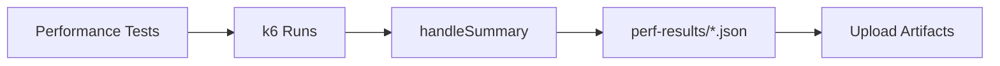
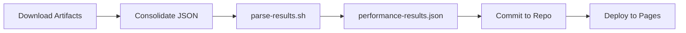
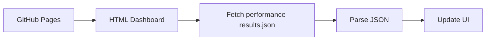

# Performance Results Parsing Implementation

## Overview

This document describes the implementation of k6 performance test results parsing for dashboard consumption in the Happy Birthday App project.

## Objective

Parse k6 JSON output from performance tests and generate a structured `performance-results.json` file that can be consumed by HTML dashboards (reports-summary.html, test-reports.html) to display performance metrics.

## Implementation Components

### 1. Performance Results Parser Script

**File**: `/scripts/performance/parse-results.sh`

A bash script that:
- Reads k6 JSON summary files from the `perf-results/` directory
- Extracts key performance metrics (RPS, latency, error rate, throughput)
- Generates a consolidated `performance-results.json` file
- Validates the output JSON
- Provides fallback defaults when no results are available

**Key Features**:
- Supports k6 summary JSON format
- Handles multiple test results (smoke test, load test, etc.)
- Calculates aggregate metrics across all tests
- Human-readable duration formatting
- Error handling with graceful degradation

### 2. k6 Test Integration

**Existing k6 Tests**:
- `/tests/performance/api-smoke.test.js` - Quick smoke test (10 VUs, ~2.5 min)
- `/tests/performance/api-load.test.js` - Load test (50+ VUs)
- Other performance tests (scheduler, worker, e2e)

**k6 Output Format**:
All k6 tests use the `handleSummary()` function to write JSON results:

```javascript
export function handleSummary(data) {
  return {
    'perf-results/smoke-test-summary.json': JSON.stringify(data, null, 2),
    stdout: generateSummary(data),
  };
}
```

### 3. CI/CD Workflow Integration

**File**: `/.github/workflows/ci-full.yml`

**Changes Made**:

1. **Check and Download Performance Artifacts** (coverage-report job):
   ```yaml
   - name: Check if performance artifacts exist
     id: check-perf-artifacts
     uses: actions/github-script@v7
     with:
       script: |
         const artifacts = await github.rest.actions.listWorkflowRunArtifacts({
           owner: context.repo.owner,
           repo: context.repo.repo,
           run_id: context.runId,
         });
         const perfArtifacts = artifacts.data.artifacts.filter(a =>
           a.name.startsWith('performance-') && a.name.endsWith('-results')
         );
         core.setOutput('exists', perfArtifacts.length > 0 ? 'true' : 'false');

   - name: Download performance test artifacts
     if: steps.check-perf-artifacts.outputs.exists == 'true'
     uses: actions/download-artifact@v4
     with:
       pattern: performance-*-results
       path: perf-artifacts/
   ```

2. **Generate Performance Results JSON** (coverage-report job):
   ```yaml
   - name: Generate performance results JSON
     run: |
       mkdir -p perf-results docs
       find perf-artifacts -name "*.json" -type f -exec cp {} perf-results/ \;
       bash scripts/performance/parse-results.sh perf-results docs
   ```

3. **Commit Performance Results** (coverage-report job):
   ```yaml
   git add docs/performance-results.json
   ```

4. **Deploy to GitHub Pages** (deploy-documentation job):
   ```yaml
   for json_file in ... performance-results.json; do
     [ -f "docs/$json_file" ] && cp "docs/$json_file" "_site/$json_file"
   done
   ```

### 4. Output JSON Format

**File**: `/docs/performance-results.json`

```json
{
  "timestamp": "2026-01-05T12:00:00Z",
  "summary": {
    "max_rps": 450.5,
    "avg_latency_p95": 125,
    "avg_latency_p99": 250,
    "max_error_rate": 0.01,
    "throughput_per_day": 38923200
  },
  "smoke_test": {
    "test": "smoke-test",
    "rps": 450.5,
    "latency_p50": 45,
    "latency_p95": 125,
    "latency_p99": 250,
    "latency_avg": 52,
    "error_rate": 0.01,
    "throughput": 38923200,
    "total_requests": 8456,
    "duration": "3m",
    "vus": 10
  },
  "load_test": {
    "test": "api-load",
    "rps": 1200,
    "latency_p50": 85,
    "latency_p95": 200,
    "latency_p99": 400,
    "latency_avg": 95,
    "error_rate": 0.05,
    "throughput": 103680000,
    "total_requests": 36000,
    "duration": "30m",
    "vus": 50
  },
  "all_tests": [...]
}
```

### 5. Dashboard Consumption

**HTML Pages That Consume Performance Data**:

1. **reports-summary.html**:
   - Performance card with summary metrics
   - JavaScript loads `performance-results.json`
   - Displays: Max RPS, Avg p95 latency, Error rate, Throughput

2. **test-reports.html**:
   - Detailed performance test results
   - Smoke test and load test metrics
   - Historical comparison (if available)

3. **dashboards-index.html**:
   - Performance dashboards overview
   - Links to detailed reports

**Example JavaScript Integration**:
```javascript
fetch('./performance-results.json')
  .then(r => r.ok ? r.json() : null)
  .then(data => {
    if (data && data.summary) {
      updatePerformanceCard(data.summary);
      updateSmokeTestMetrics(data.smoke_test);
      updateLoadTestMetrics(data.load_test);
    }
  })
  .catch(err => console.log('Performance data not available'));
```

## Metrics Extracted

### From k6 Summary JSON

| Metric | k6 Path | Description |
|--------|---------|-------------|
| RPS | `metrics.http_reqs.values.rate` | Requests per second |
| Latency p50 | `metrics.http_req_duration.values["p(50)"]` | Median latency (ms) |
| Latency p95 | `metrics.http_req_duration.values["p(95)"]` | 95th percentile latency (ms) |
| Latency p99 | `metrics.http_req_duration.values["p(99)"]` | 99th percentile latency (ms) |
| Latency avg | `metrics.http_req_duration.values.avg` | Average latency (ms) |
| Error Rate | `metrics.http_req_failed.values.rate` | HTTP error rate (0-1, converted to %) |
| Total Requests | `metrics.http_reqs.values.count` | Total HTTP requests made |
| VUs | `metrics.vus.values.max` | Max virtual users |
| Duration | `state.testRunDurationMs` | Test duration (ms, converted to human-readable) |

### Calculated Metrics

| Metric | Calculation | Description |
|--------|-------------|-------------|
| Throughput | `RPS * 86400` | Messages per day |
| Summary Max RPS | `max(all_tests.rps)` | Highest RPS across all tests |
| Summary Avg p95 | `avg(all_tests.latency_p95)` | Average p95 latency across all tests |
| Summary Avg p99 | `avg(all_tests.latency_p99)` | Average p99 latency across all tests |
| Summary Max Error | `max(all_tests.error_rate)` | Highest error rate across all tests |

## Workflow Flow

### Performance Test Execution



### Results Parsing



### Dashboard Consumption



## Testing the Implementation

### Local Testing

1. **Run k6 tests locally**:
   ```bash
   k6 run tests/performance/api-smoke.test.js
   ```

2. **Parse results**:
   ```bash
   bash scripts/performance/parse-results.sh perf-results docs
   ```

3. **Verify output**:
   ```bash
   cat docs/performance-results.json | jq '.'
   ```

### CI Testing

1. **Trigger workflow**:
   - Push to main branch
   - Performance tests run automatically
   - Results are parsed and committed

2. **Verify in GitHub Actions**:
   - Check "Generate performance results JSON" step logs
   - Download artifacts to inspect JSON files
   - View deployed GitHub Pages to see dashboard

## Error Handling

### Graceful Degradation

If no performance results are available:
- Script creates a default `performance-results.json` with zero values
- Dashboard displays "N/A" or default values
- CI workflow continues without failure

### Validation

- All generated JSON is validated with `jq empty`
- Script exits with error code if JSON is invalid
- Fallback to defaults on parsing errors

## Dependencies

### Runtime Dependencies
- `bash` - Shell script execution
- `jq` - JSON parsing and validation
- `bc` - Floating point arithmetic
- `find` - File search
- `date` - Timestamp generation

### k6 Dependencies
- k6 tests must implement `handleSummary()`
- k6 must write JSON to `perf-results/*.json`
- k6 summary must include required metrics

## Future Enhancements

1. **Historical Tracking**:
   - Store performance results over time
   - Generate trend charts
   - Performance regression detection

2. **Threshold Validation**:
   - Define performance SLIs/SLOs
   - Fail CI if thresholds are breached
   - Alert on performance degradation

3. **Multiple Test Types**:
   - Separate results for smoke, load, stress, spike tests
   - Per-endpoint performance tracking
   - Geographic performance comparison

4. **Advanced Metrics**:
   - Custom k6 metrics extraction
   - Database query performance
   - Message queue throughput
   - Cache hit rates

5. **Integration with Monitoring**:
   - Push results to Prometheus
   - Create Grafana dashboards
   - Set up alerting rules

## Files Created/Modified

### New Files
- `/scripts/performance/parse-results.sh` - Performance results parser
- `/scripts/performance/README.md` - Scripts documentation
- `/docs/performance-results.json` - Sample output
- `/PERFORMANCE_RESULTS_IMPLEMENTATION.md` - This document

### Modified Files
- `/.github/workflows/ci-full.yml`:
  - Added "Download performance test artifacts" step
  - Added "Generate performance results JSON" step
  - Updated commit step to include performance-results.json
  - Updated deploy step to copy performance-results.json to GitHub Pages

## References

- [k6 Documentation](https://k6.io/docs/)
- [k6 Results Output](https://k6.io/docs/results-output/end-of-test/)
- [k6 Custom Summary](https://k6.io/docs/results-output/end-of-test/custom-summary/)
- [GitHub Actions Artifacts](https://docs.github.com/en/actions/using-workflows/storing-workflow-data-as-artifacts)
- [GitHub Pages](https://docs.github.com/en/pages)

## Author

Implementation completed as part of the Happy Birthday App performance monitoring initiative.

**Date**: 2026-01-05

## Changelog

### v1.0.0 - 2026-01-05
- Initial implementation of performance results parsing
- Integration with CI/CD workflow
- Sample performance-results.json
- Comprehensive documentation
